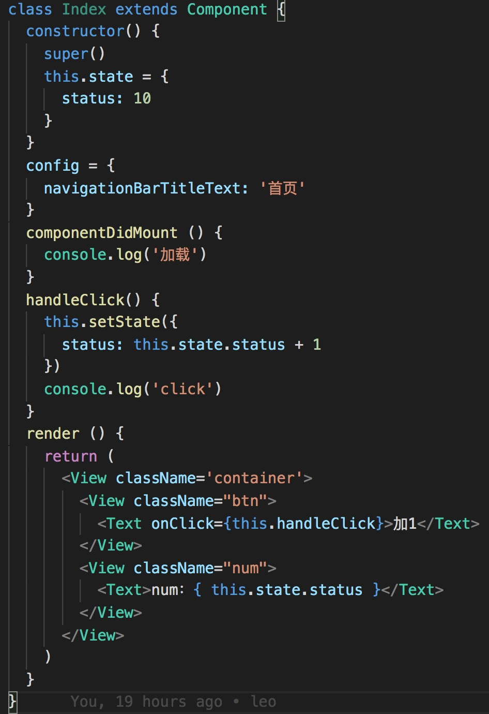
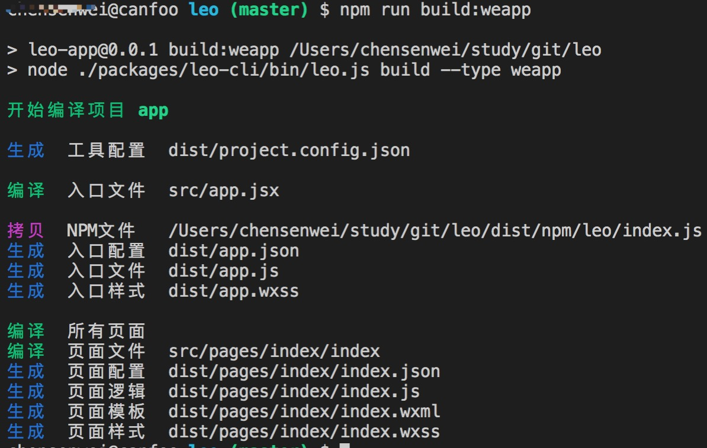

# Leo

> Leo，雷欧奥特曼，泰罗·奥特曼（Taro）的弟弟。

## 简介
taro的简化版（实现 react -> weapp 的转换）。


## 如何使用
安装

```
npm install
```

编译
```
npm run build:weapp
```

编译完成直接用小程序开发工具打开dist目录即可

## 演示（取自本项目代码）

源码（react 语法）



编译过程



效果


